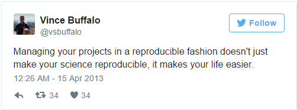

## Vetorização

É de extrema relevância compreender que o R é um software vetorizado. Isso simplesmnte quer dizer que variáveis e funções podem receber vetores. 

Veja os exemplos abaixo:

```{r}
1:5
```

```{r}
2 ^ (1:5)
```

```{r}
x <- 1:5
2 ^ x
```

A possibilidade de variáveis e funções receber valores faz do R um software extremamente poderoso. Este tópico será abordado em detalhes adiante.

## Controlando o ambiente de trabalho

Existem alguns comandos que o usuário pode utilizar para interagir com o ambiente de trabalho do R.

A função `ls`, por exemplo, lista todas as variáveis e funções gravadas no ambiente de trabalho.

```{r}
ls()
```

***
> <p> Dica: Objetos escondidos</p>
 
A função `ls()`não mostra variáveis e funções que começão com `.`. Para listar todos os objetos, inclusive os que iniciam com `.`, digite `ls(all.names=TRUE)` e não `ls()`.

Note que na função `ls` não é necessário fornecer argumentos, mas é necessário colocar parêntesis para que o R entenda que se trata de uma função.

***

Se digitarmos apenas `ls` o R nos fornecerá o código fonte da função.

```{r}
ls
```

Pode ser interessante deletar objetos que não serão utilizados adiante. Para isso utilizamos a função `rm`.

```{r}
rm(x)
```

Se muitos objetos devem ser excluídos de uma só vez não há necessidade de excluir um por um. Basta utilizar a função `ls` conjugada com a `rm` da seguinte forma:

```{r}
rm(list=ls())
```

Neste caso duas funções foram utilizadas em conjunto. Sempre que este for o caso o que está localizado dentro do parêntesis mais interno será avaliado primeiro e assim em diante.

No caso acima foi especificado que o resultado da função `ls` deveria ser usado na forma de lista `list` como argumento da função `rm`. Quando destinados valores de argumentos a funções por nome, o operador a ser utilizado deverá ser o símbolo `=`.

Se utilizarmos `<-` teremos efeitos indesejados ou  mensagens de erro.

```{{r, error=TRUE}}
rm(list <- ls())
```

***
> <p> Dica: Avisos vs Erros</p>

Fique atento pois o R poderá fazer algo inesperado. Erros, como no caso acima, ocorrem quando o R não consegue efetuar as operações. Avisos, por outro lado, indicam que o R conseguiu efetuar as operações, mas algo  provavelmente não ocorreu como esperado.

Em ambos os casos, as mensagens que o R fornece ajudam a consertar o problema.
***

## Pacotes do R

É possível adicionar funções ao R através da escrita de pacote escritos por você mesmo, ou por pacotes escritos por outras pessoas. Hoje existem mais de 7000 pacotes disponíveis no CRAN (*the comprehensive R archive network*). O R e o Rstudio possuem elevada funcionalidade no quesito de gerenciamento de pacotes:

* É possível ver quais pacotes estão instalados. Para isso devemos digitar `installed.packages()`.
* É possível instalar novos pacotes ao digitar `install.packages("packagename")`, onde `packagename` é o nome do pacote a ser instalado. 
* É possível atualizar pacotes já instalados. A função utilizada é `update.packages()`.
* É possível remover pacotes com a função `remove.packages("packagename")`. 
* É possível tornar um pacote habilitado ao uso. A função utilizada neste caso é `library(packagename)`.

***
Desafio 1

Quais nomes a seguir são válidos para variáveis no R ?

*  min_height
*  max.height
*  _age
*  .mass
*  MaxLength
*  min-length
*  2widths
*  celsius2kelvin

***

***
Desafio 2

Quais serão os valores das variáveis definidas abaixo ?

* massa <- 47.5
* idade <- 122
* massa <- mass * 2.3
* idade <- age - 20

***

***
Desafio 3

Rode os códigos do desafio anterior, escreva um comando e compare massa com idade. A massa é maior que a idade ? 

***

***
Desafio 4

Limpe o seu ambiente de trabalho. Delete as variáveis massa e idade.
***

***
Desafio 5

Instale os pacotes `ggplot2`, `plyr` e `gapminder`.
***

***
> Pontos chave:

* Use o RStudio para escrever e rodar programas em R.
* O R possui os operadores aritméticos e funções matemáticas usuais.
* Use `<-` para designar valores para variáveis.
* Use `ls()` para listar as variáveis de um programa.
* Use `rm()` para deletar objetos de um programa.
* Use `install.packages()` para instalar pacotes.

***

# Gerenciamento de projetos com RStudio
***
> Visão Geral:

* **Ensino:** 20 min
* **Exercícios:** 10 min

* **Perguntas**
    + Como eu posso gerenciar meus projetos no R ?

* **Objetivos**
    + Ser capaz de criar projetos independentes com RStudio
    + Ser capaz de usar o git com o RStudio

***

## Introdução

O processo científico é de natureza incremental. Muitos projetos começam com notas ou códigos aleatórios e a partir disso surgem manuscritos. Eventualmente essas escritas e códigos se misturam.

<p> 

A maioria das pessas organizam seus projetos da seguinte maneira


Por diversas razões SEMPRE devemos evitar esse tipo de armazenamento de projetos:

***
1. É difícil ver qual versão é a original e quais são as modificadas.
2. Deste modo obtemos diversas extensões de arquivos na mesma pasta.
3. Provavelmente iremos demorar bastante para para encontrar alguma coisa. Relacionar uma figura com o código que a gera, por exemplo.
***

Um bom *layout* pode facilitar bastante nossa vida. Algumas vantagens são:

***
* Nos ajuda a assegurar a integridade dos dados;
* Facilita o compartilhamento dos códigos com outras pessoas (colegas de laboratório, colaboradores ou supervisores);
* Facilita o processo de atualização dos códigos;
* É mais fácil encontrar um projeto após algum tempo.

***

## Uma possível solução

Existem ferramentas e pacotes que nos ajudam a gerenciar nosso trabalho de forma mais efetiva.

Uma das melhores características do RStudio, são as funcionalidades oferecidas em termos de gerenciamento de projetos. Usaremos tais ferramentas para uma criar um projeto independente e passível de ser reproduzido.

***
Desafio: Criando um projeto independente

 1. Clique no botão File e então em  New Progect.
 2. Clique em New Directory.
 3. Clique em Empty Project.
 4. Digite o nome do diretório que em que seu projeto será gravado.
 5. Clique em Create a git repository.
 6. Clique em Create Projeto.

***
 
Agora, toda vez que iniciarmos uma sessão desse projeto no RStudio todo o trabalho estará inteiramente contido neste diretório. 

## Melhores práticas aplicadas a organização de projetos

Embora não exista a `MELHOR` forma de organizar um projeto, existem alguns princípios gerais que são consistentes com o objetico de deixar o gerenciamento de projetos mais simples.

### Trate os dados apenas como leitura

Este é provavelmente o principal objetivo ao organizar um projeto. Dados geralmente são difíceis de se coletar. Trabalhar com dados em programas interativos (Excel) onde eles podem ser modificados atrapalha. Isso porque não temos certeza de onde os dados vieram ou como foram modificados desde a coleta. Para evitar este tipo de problema é recomendável trabalhar os dados como arquivos apenas para leitura.

### Limpeza dos dados

Em muitos casos os dados são "sujos". Nestes casos é extremamente difícil transformar os dados até que eles sejam passíveis de serem lidos pelo R (ou qualquer outro programa). Esta tarefa é geralmente chamada de "data munging". Quando alterações devem ser feitas no conjunto de dados original, é aconselhável criar um segundo arquivo de leitura em uma pasta separada.

### Trate as saídas como dispensáveis

Quaisquer coisas geradas pelos scripts devem ser tratadas como dispensáveis. Devemos ser capazes de recriar as alterações ou análises feitas a partir do script.

Existem diversas maneiras de gerenciar os outputs. É interessante termos uma pasta com subdiretórios para cada análise que formos fazer. Desta maneira é mais fácil encontrar as análises de interesse, pois ao mesmo tempo que nem todas as análises feitas são utilizadas no trabalho final, outras poderão ser aplicadas em outros projetos.

***
> <p>Dica: Praticas interessantes em computação científica</p>


[Boas práticas em computação científica](https://github.com/swcarpentry/good-enough-practices-in-scientific-computing/blob/gh-pages/good-enough-practices-for-scientific-computing.pdf) sugerem as recomendações para uma boa organização de projetos:

1. Coloque cada projeto em seu próprio diretório. O diretório deve ser nomeado após o projeto.
2. Coloque documentos de textos associados a um diretório `doc`.
3. Coloque os dados puros no diretório `data`, os dados alterados e os dados limpos devem ser colocados em uma pasta `results`.
4. Coloque os scripts e os programas em um diretório `src`. Os programas importados de outros locais devem ser alocados no diretório `bin`.
5. Escolha nomes que indiquem a função de cada arquivo.

***

***
> <p> Dica: Modelo de projeto - uma possível solução</p>

Uma maneira de automatizar o gerenciamento de projetos se dá com a instalação do pacote `ProjectTemplate`. Esse pacote oferece uma estrutura que é considerada ideal para o bom gerenciamento do projeto. O pacote é útil porque mostra o fluxo de trabalho de forma organizada e estruturada. Com o RStudio e com o Git é possível ter controle total dos trabalhos, além de facilitar o compartilhamento dos arquivos com colaboradores.

1. Instale o pacote ProjectTemplate
2. Carregue o pacote
3. Inicie o projeto:

```{r,error=TRUE, echo=FALSE}
install.packages("ProjectTemplate")
library(ProjectTemplate)
create.project("../my_project", merge.strategy = "allow.non.conflict")
```

***

Para mais informações sobre o pacote `ProjectTemplate` e suas funcionalidades acesse [ProjectTemplate](http://projecttemplate.net/index.html).

### Separe as funções das aplicações

O modo mais efetivo de trabalhar no R é brincando com os códigos na sessão interativa. Quando temos certeza de que os códigos funcionam e fazem o que queremos, copiamos para um arquivo de script. Também é possível salvar todos os comandos utilizados, para isso utilizamos a função *history()*. Utilizar essa função nem sempre é útil pois quando estamos desenvolvendo algum programa novo surgem muitos erros.

***
> <p> Dica: evite duplicação</p>

É possível que o mesmo conjunto de dados e o mesmo script sejam usados em projetos distintos. De modo geral queremos evitar a duplicação de arquivos de modo a salvar espaço e não termos que atualizar o mesmo código em diferentes lugares.

Quando este for o caso é interessante usar *symbolic links*, que são atalhos para arquivos que se encontram em outro lugares. No Linux e no OS X podemos usar o comando `ln -s`, no Windows podemos criar um atalho ou usar o comando `mklink` no terminal de comandos.
***


